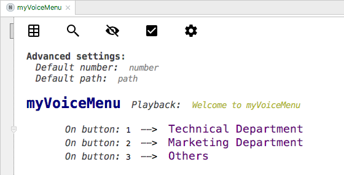
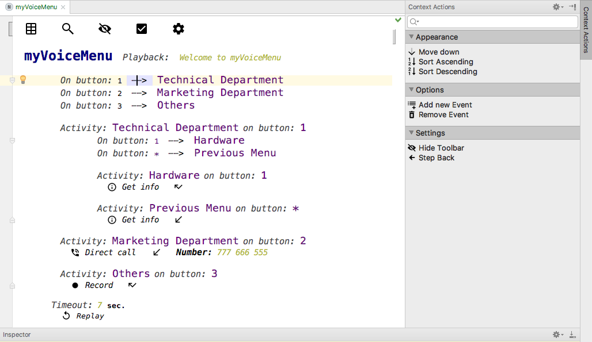
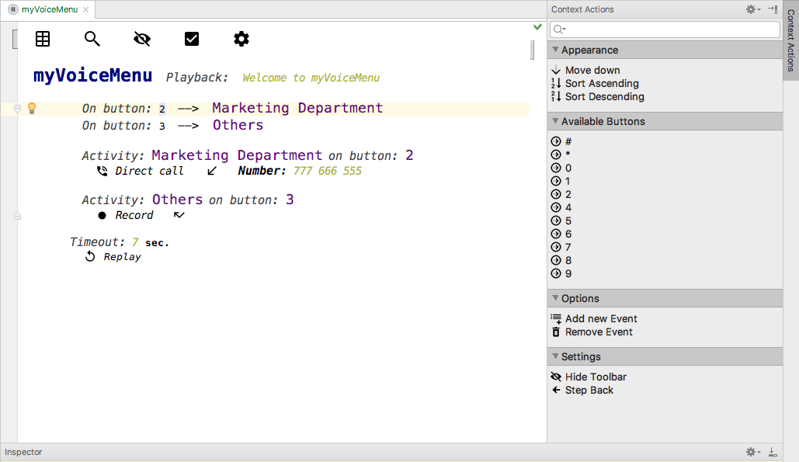
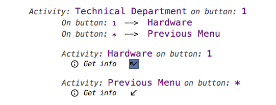

Advanced options
================

This section focuses on tips and tricks that can help user for more fluent editing.

Advance settings
-----------------

If you want to generate Asterisk code, you need to specify the place where the asterisk files are stored on the server. Also setting up the number that to enter the voice menu is useful. Those information are possible to fill in after showing the advanced setting by clicking on the settings icon in the toolbar.

Deleting whole activity
-----------------------

You have just defined some menu full of activities.

In case that you decide that you want to delete whole activity and its declaration and all its nested actions you can just simply click on declaration or on Activity and press `DELETE` or `BACKSPACE` and whole action will be deleted.

Final and NonFinal actions
-----------------------

You might be thinking how to solve that, for example, after providing caller information by `Get Info` you would like to choose if called should go back in previous menu or just to hang up the call? Heres how to do that.
This could be done by clicking on the arrow next to the action.

