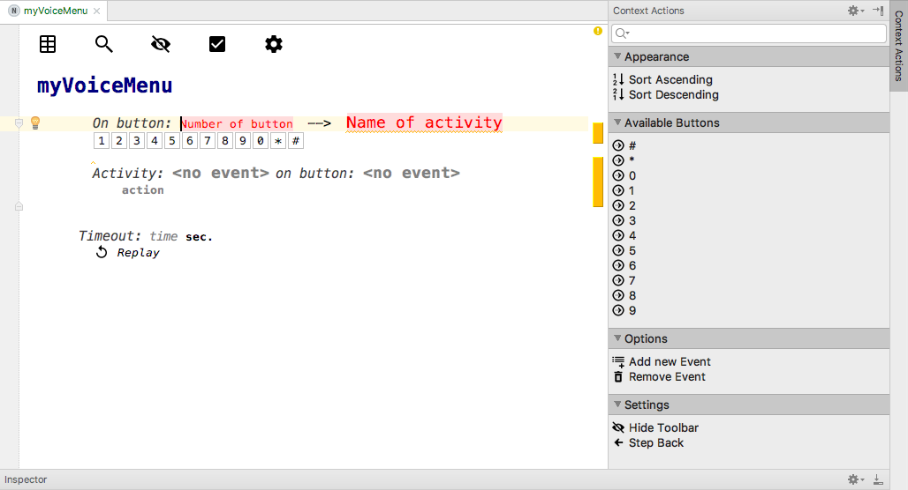
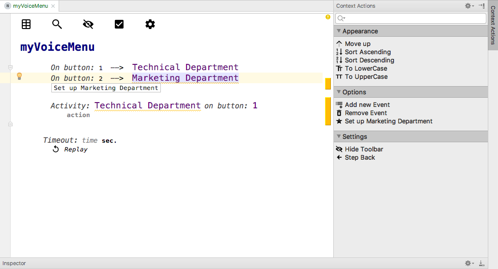
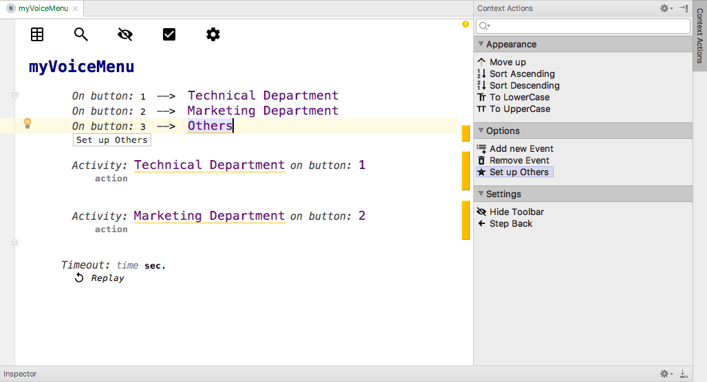
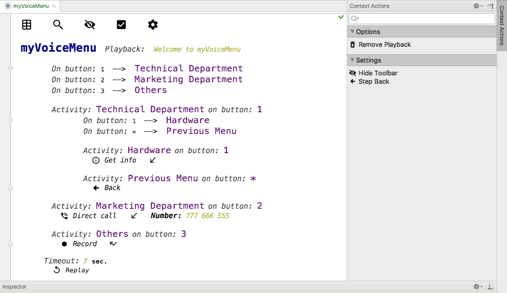
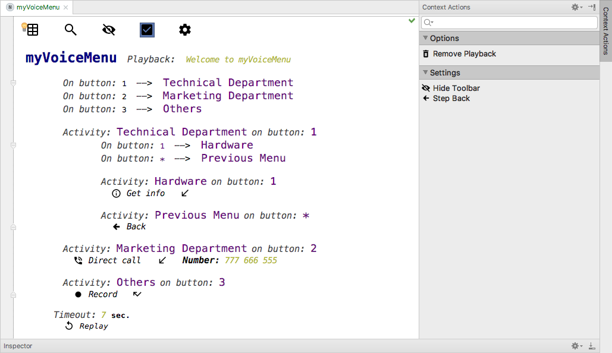
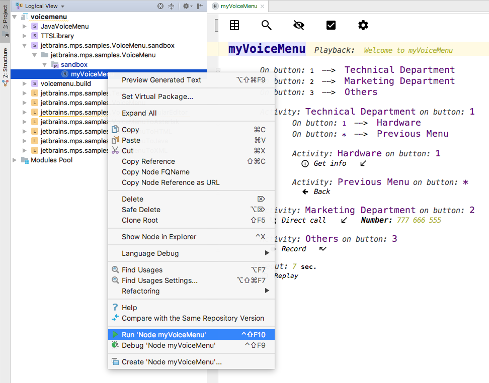

First Steps
===========

Simple guide showing how to build the very first voice menu.

To start with your first voice menu, create a new model in the sandbox solution with WorkSpace as the root. (The  advanced shortcut for autocomplete is Ctrl + Space; to invoke intentions, press Alt + Enter.)
In the first step we assign triggers (phone buttons) and names to activities. Simply fill in each gap one by one. Add up to 12 buttons. Use the Context Action panel (the one on the right side). Only valid options are shown there for every required field.

Now is time to add some options to the menu.

As we completed the first step, let's move on to the second one - specifying the action. To do this, click `Set up` in the Context Action panel (or anywhere else you can click  `Set up ..` 

Very useful feature is adding Playback to the menu. When user enters the particular menu, text or file specified in cell playback will be automatically played. To achieve that select menu in which you want to add playback and in side panel click on `Add Playback`

At the second step, we select what actually happens under the hood of the Event which we gave the trigger (phone button) and that shiny name in the first step. Both the name and the trigger of the Event are completed automatically. Choose if the Event is a Menu (select Menu) or a concrete Action.

Fill in the rest of the Events. Remember: all events are created in the very same way/ Every Event has its own name even it’s the same as the name of an action. For example: A voicemenu designer would like to have an Event on the button 2 with the action Direct Call.
* A possible solution might be an Event with properties: name = "Direct Call" , trigger = 2, activity = Direct Call.
 

After finishing your menu is nice habit to click on `All Fix Button`  to verify that there are no mistakes.

Let's try the very first solution. Rebuild the whole project. At the very top of the screen click `Build` and choose `Rebuild Project`. Right click the myVoicemenu sandbox solution in the left panel and choose `Run` .

----------

Good job!!!

