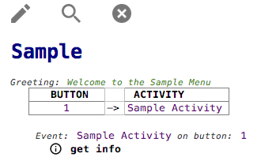
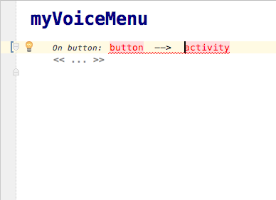
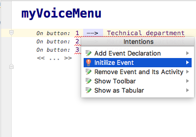
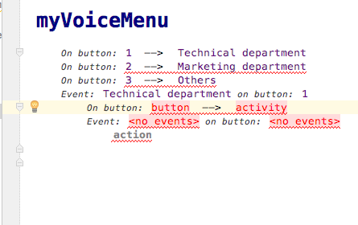
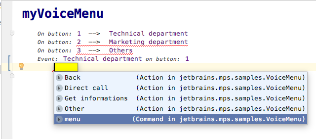
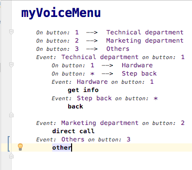

Voice Menu - Language
=======================

Place where the language is defined

Sample
------

A little demonstration of what an editor looks like

Toolbar
-------

Toolbar with action buttons for more pleasant usage

    Switch Editor Hints

    Find Error in code

    Hide Toolbar

How to use
----------

To start with your first voice menu create new model in sandbox solution with `WorkSpace` as the root. It's highly recommended to use either autocomplete `Ctrl + Space` or intentions `Alt + Enter` for easier usage.

Simply fill in in each gap one by another. 
Add upto 12 buttons.

Click on the button you would like to specify an Event to and press `Alt Enter` for Intentions/Quickfixes.
Choose "Initiliaze Event". (It might be done manually without quickfix)

Both the name and the trigger of the event was completed automatically. Choose if the Event is an Action (if so choose which concrete action) or a Menu.

Fill the rest of the Events in a similiar way.

Let's try the very first solution!
Rebuild the whole project. At the very top of the screen click on `Build` and choose `Rebuild Project`.
Right click the myVoicemenu sandbox solution in the left panel and choose `Run` .

Intentions 
-----------------

* **Global** - Switching Editors (Regular or Tabular) 
* **Global** - Toolbar 

* **WorkSpace** - Add/Remove Greeting

* **Event Declaration** - Add (another) event declaration
* **Event Declaration** - Remove event and it's activity

* **Event Initialization** - Add/Remove Greeting
* **Event Initilization** - Initiliaze (another) new event

* **Action** - Change to different action/menu

Quickfixes
----------
Different errors invoke different quickfixes.

* **Event Declaration** - Replace with correct input number
* **Event Declaration** - Remove duplicate number
* **Event Declaration** - Initiliaze Event

* **Event Initilization** - Remove duplicate activity
* **Event Initilization** - Reset name
* **Event Initilization** - Initiliaze Event
* (**Event Initilization** - Initiliaze Menu - autoFix, cannot be invoked)

Intentions
----------

Mostly different intentions are specified for each of nodes.
All intentions are invoked by pressing `Alt + Enter` shortcut.

|Event Declaration|Activity|Action|Global|
|-----------------|--------|------|------|
|Sort Ascendind|Initiliaze New Event|Change Action to Back|Hide Toolbar|
|Sort Descending|Make Declaration|Change Action to Other|Show Toolbar|
|Move Up|Remove Greeting|Change Action to Direct Call|Show as Structural|
|Move Down|Add Greeting|Change Action to Get Info|Show as Tabular|
|Remove Evnt. + its Actvt.|Remove Actvt. + its Evnt.|Change Action to Menu|||

TypeSystem
----------
Different errors invoke different quickfixes.

|Checking rule| |QuickFix|
|-------------|-|--------|
|CheckActionImplemented|-->|InitilizeEvent|
|CheckDuplicateNumber|-->|RemoveNumber|
|CheckDuplicateNumber|-->|SuggestNumber|
|CheckEmptyMenu|-->|InitiliazeMenu|
|CheckPhoneButtons|-->|SuggestNumber|
|CheckMultipleActvOneEvnt|-->|RemoveActivity|
|CheckMultipleActvOneEvnt|-->|RenameActivity|
