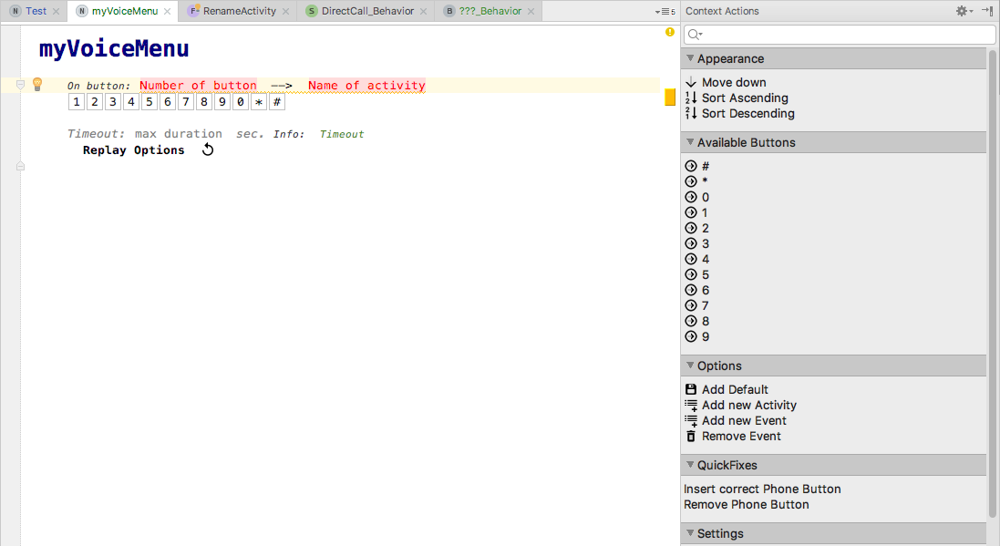
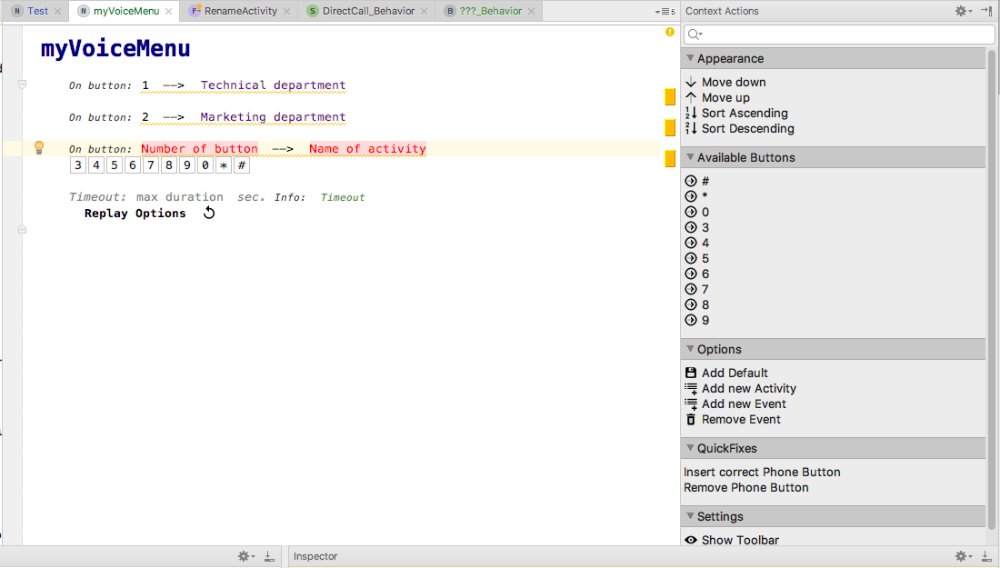
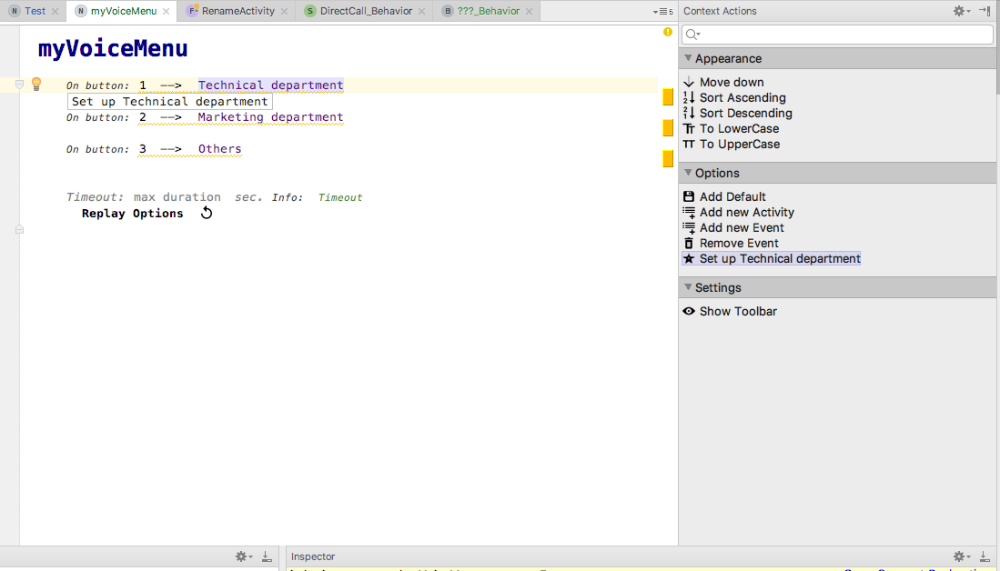
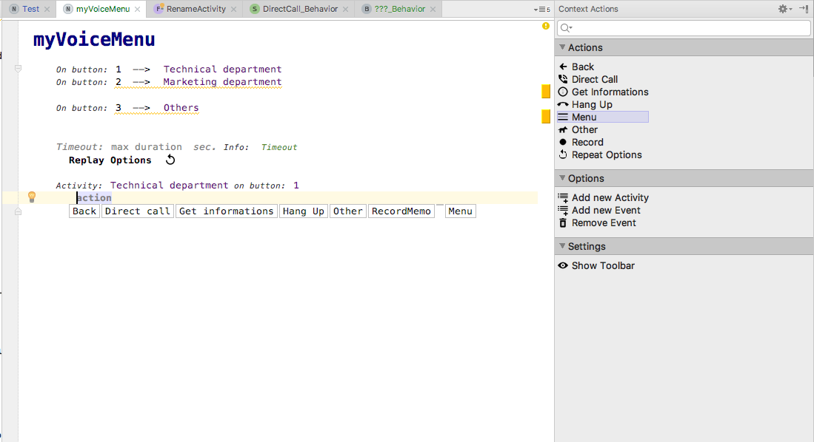
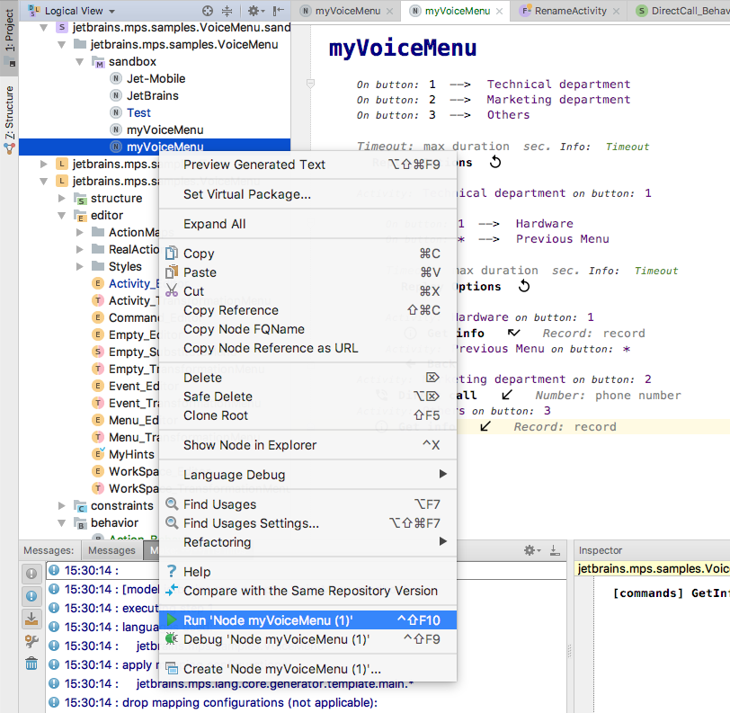

Voice Menu - Language
=======================

Place where the language is defined

Sample
------

A little demonstration of what an editor looks like

Toolbar
-------

Toolbar with action buttons for more pleasant usage

    Switch Editor Hints

    Find Error in code

    Hide Toolbar

How to use
----------

To start with your first voice menu create a new model in the sandbox solution with `WorkSpace` as the root. It's highly recommended to use either autocomplete `Ctrl + Space` or intentions `Alt + Enter` for easier usage.

In the first step we assign phone buttons and names to activities.
Simply fill in in each gap one by another. 
Add upto 12 buttons.

Either click on Context tool or in the right Context Action panel choose `Set up ..`

Let's complete the second step in which we select what actually happens under the hood to the activity which we gave its trigger (pressed phone button) and that shiny name in the first step.
Both the name and the trigger of the Activity are completed automatically. Choose if the Activity is subMenu (select Menu) or is a concrete Action 

Fill the rest of the Events in a similiar way.

Let's try the very first solution!
Rebuild the whole project. At the very top of the screen click on `Build` and choose `Rebuild Project`.
Right click the myVoicemenu sandbox solution in the left panel and choose `Run` .

Intentions
----------

Mostly different intentions are specified for each of nodes.
All intentions are invoked by pressing `Alt + Enter` shortcut.

|Event Declaration|Activity|Action|Global|
|-----------------|--------|------|------|
|Sort Ascendind|Initiliaze New Event|Change Action to Back|Hide Toolbar|
|Sort Descending|Make Declaration|Change Action to Other|Show Toolbar|
|Move Up|Remove Greeting|Change Action to Direct Call|Show as Structural|
|Move Down|Add Greeting|Change Action to Get Info|Show as Tabular|
|Remove Evnt. + its Actvt.|Remove Actvt. + its Evnt.|Change Action to Menu|||

TypeSystem
----------
Different errors invoke different quickfixes.

|Checking rule| |QuickFix|
|-------------|-|--------|
|CheckActionImplemented|-->|InitilizeEvent|
|CheckDuplicateNumber|-->|RemoveNumber|
|CheckDuplicateNumber|-->|SuggestNumber|
|CheckEmptyMenu|-->|InitiliazeMenu|
|CheckPhoneButtons|-->|SuggestNumber|
|CheckMultipleActvOneEvnt|-->|RemoveActivity|
|CheckMultipleActvOneEvnt|-->|RenameActivity|
