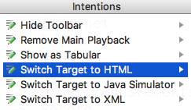

Voice Menu - HTML Generator
==========================

Generation of html code from domain specific language

Sample
------

```html
  <menu>
      <table class="roundedCorners">
        <tr>
          <th>Event</th>
          <td>   </td>
          <th>Trigger</th>
        </tr>
        <tr>
          <td>Sample Activity</td>
          <td>   </td>
          <td>1</td>
        </tr>
      </table>
      
      <activity>
        <b style="margin-left: 40px;color:blue">Sample Activity</b>
          <p>          
            <action style="margin-left: 80px;color:red">--> [ Get Info ]</action>
          </p>
      </activity>
      
    </menu>

```


Select Generator
---------

Choose the generator which suits your needs:

* Click Alt + Enter or click on Light Bulb
* Switch target language

  [](https://github.com/vaclav/voicemenu/blob/master/extras/Intention_Switch_Target.png)

**or**

* Right click on Solution model (sandbox) and choose Model Properties
* Select target language in Model Properties --> Advanced --> Languages engaged on generation 


   [](https://github.com/vaclav/voicemenu/blob/master/extras/sandbox_menu.png)
   
   
   
* Possible target languages:      
```
    jetbrains.mps.samples.VoiceMenuToJava
    jetbrains.mps.samples.VoiceMenuToXML
    jetbrains.mps.samples.VoiceMenuToHTML
    jetbrains.mps.samples.VoiceMenuToAsterisk
```
* Click on blue button OK
* Rebuild the Solution Model
