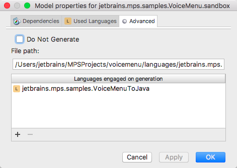

Voice Menu - XML Generator
=======================

Generation of xml code from domain specific language


Sample
------

```xml
<?xml version = "1.0" encoding = "UTF-8" standalone = "no"?>
<state_machine>
  
  <state id="Sample" isInitial="true">
    <toast>Welcome to the Sample Menu</toast>
    
    
    <activity event="1" target_child="Sample Activity">
      <state id="Sample Activity">
        <action name="Get Info"></action>
      </state>
      
    </activity>
    
  </state>
</state_machine>
```

Select Generator
---------

Choose the generator which suits your needs:

* Right click on Solution model (sandbox) and choose Model Properties
* Select target language in Model Properties --> Advanced --> Languages engaged on generation 


   [](https://www.jetbrains.com/mps/)
   
   
* Possible target languages:      
```
    jetbrains.mps.samples.VoiceMenuToJava
    jetbrains.mps.samples.VoiceMenuToXML
    jetbrains.mps.samples.VoiceMenuToHTML
```
* Click on blue button OK
* Rebuild the Solution Model
